# Unit 21 Homework: Charity Funding Predictor

# Report on the Neural Network Model

# Overview
The nonprofit foundation Alphabet Soup wants a tool that can help it select the applicants for funding with the best chance of success in their ventures. With our knowledge of machine learning and neural networks, we’ll use the features in the provided dataset to create a binary classifier that can predict whether applicants will be successful if funded by Alphabet Soup.

From Alphabet Soup’s business team, we have received a CSV containing more than 34,000 organizations that have received funding from Alphabet Soup over the years. Within this dataset are a number of columns that capture metadata about each organization, such as:
* EIN and NAME - Identification columns
* APPLICATION_TYPE - Alphabet Soup application type
* AFFILIATION - Affiliated sector of industry
* CLASSIFICATION - Government organization classification
* USE_CASE - Use case for funding
* ORGANIZATION - Organization type
* STATUS - Active status
* INCOME_AMT - Income classification
* SPECIAL_CONSIDERATIONS - Special considerations for application
* ASK_AMT - Funding amount requested
* IS_SUCCESSFUL - Was the money used effectively

# Methodology

## Preprocess the Data
* Created a dataframe containing the charity_data.csv data and checked for null values, duplicate values and correlation between features
* 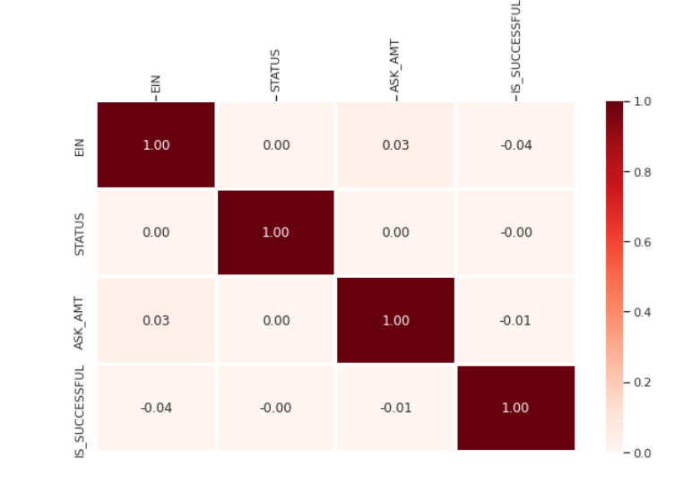
* Identifed:
    * Target: IS_SUCCESSFUL
    * Feature variables:
        APPLICATION_TYPE 
        * AFFILIATION 
        * CLASSIFICATION 
        * USE_CASE
        * ORGANIZATION 
        * STATUS 
        * INCOME_AMT 
        * SPECIAL_CONSIDERATIONS 
        * ASK_AMT 
* Dropped the EIN and NAME columns 
* Determined the number of unique values in each column 
* For columns with more than 10 unique values, determined the number of data points for each unique value 
* Created a new value called Other that contains rare categorical variables 
* Converted categorical data to numeric with pd.get_dummies
* Created a feature array, X, and a target array, y by using the preprocessed data
* Split the preprocessed data into training and testing datasets
* Scaled the data by using a StandardScaler that has been fitted to the training data

## Compile, Train, and Evaluate the Model
* Created a neural network model with a defined number of input features and nodes for each layer
* Created one hidden layer with 10 units, relu activation function
* Created an output layer with one unir and sigmoid activation function (since binary classification)
* 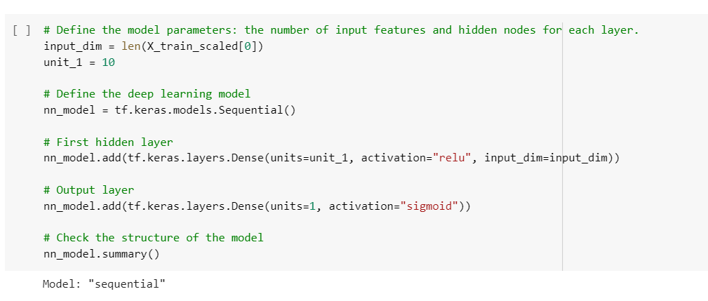
* Checked the structure of the model 
* Compiled and train the model for 15 epocs
* Evaluated the model using the test data to determine the loss and accuracy 
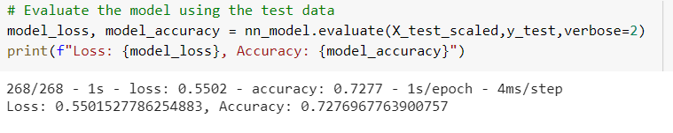
* Exported the results to an HDF5 file named AlphabetSoupCharity.h5 

## Optimize the Model
* Repeated the preprocessing steps in a new Jupyter notebook 
* Created a new neural network model, implementing 3 model optimization methods:

##### First Optimized Model
* First optimized model was created by:
    * Increasing the number of hidden layer (3 layers) 
    * Increasing the number of units per layer (20, 15, 10 respectively). 
    * relu activation function was used for hidden layers.
    * Increased the epocs to 100
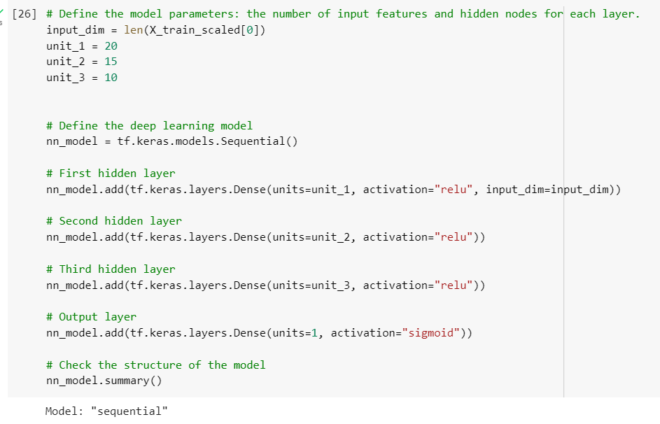
* Result:
    * 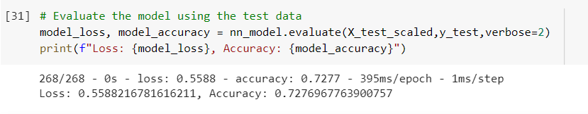
* Saved and exported the results to an HDF5 file named Optimized_AlphabetSoupCharity_1.h5

##### Second Optimized Model

* To create the second optimized model, keras tuner with following hyperparameters was used:
    * Activation: relu, tanh, sigmoid
    * Number of neurons in first hidden layer: 1-30
    * Number of hidden layers: 1-5
    * Number of neurons in other hidden layer: 1-30
    * Number of epocs: 30 
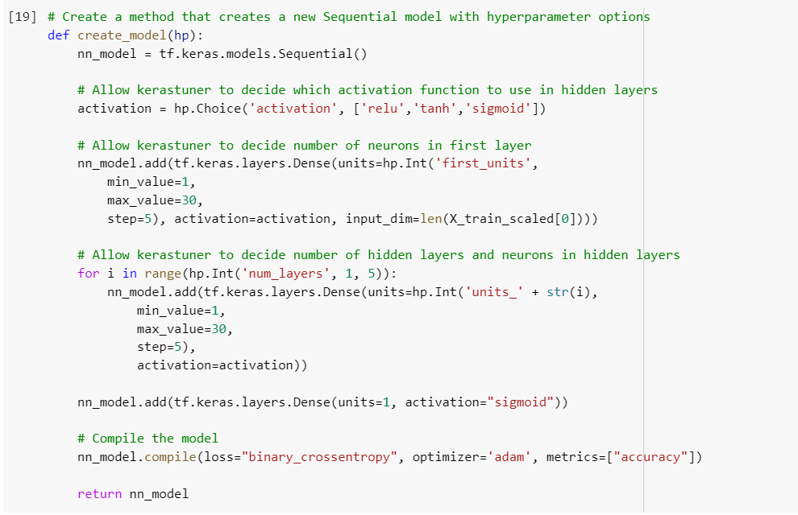
* Result:
    *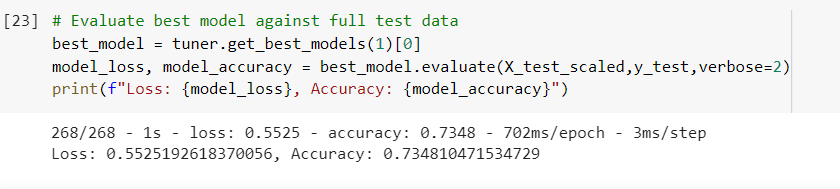
* Saved and exported the results to an HDF5 file named Optimized_AlphabetSoupCharity_2.h5

* Used the best model hypreparameters to creat a new model using 200 epochs
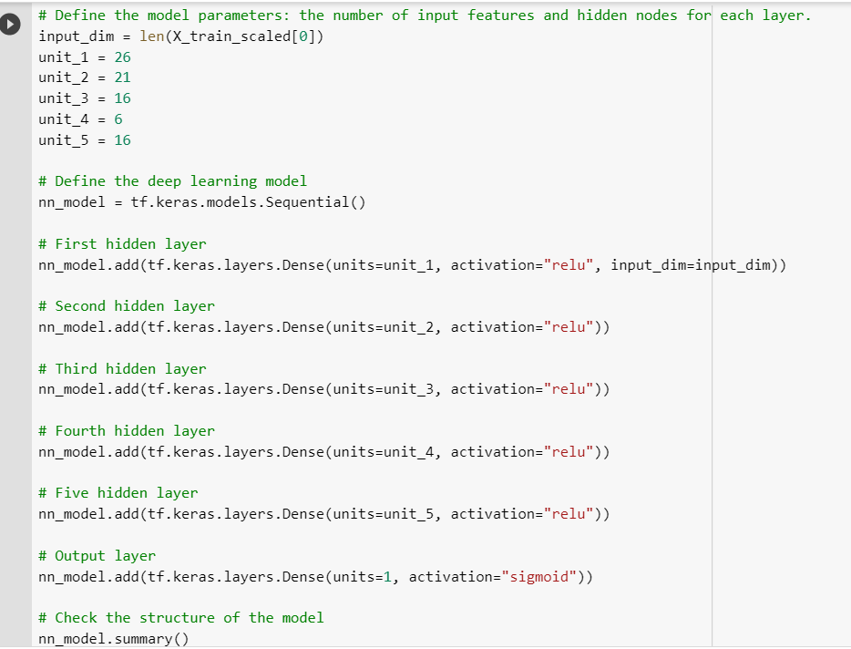
* Result:
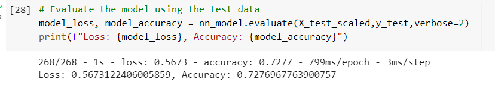
* Saved and exported the results to an HDF5 file named Optimized_AlphabetSoupCharity_2.1.h5

##### Third Optimized Model
* Third optimized model was created by: 
    * Only dropping the EIN column and keeping the NAME column as one of the features, 
    * Using 3 hidden layers with 20, 15 and 10 neurons respectively. 
    * relu activation function was used for hidden layers.
    * Number of epocs: 100 
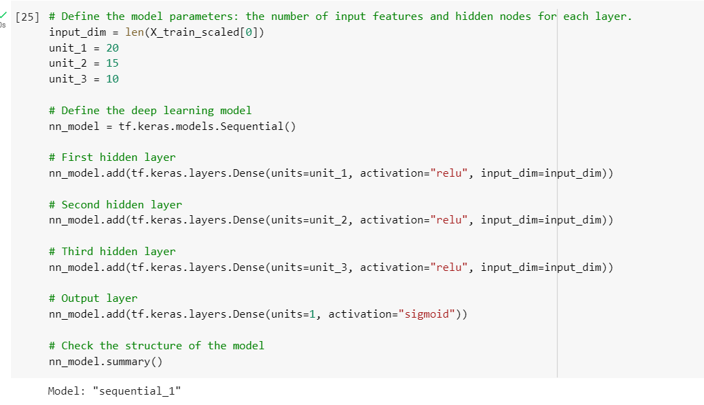
* Result:
    * 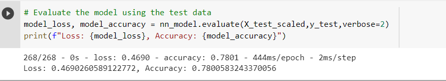
* Saved and exported the results to an HDF5 file named Optimized_AlphabetSoupCharity_3.h5

## Analysis/ Summary
* The intial model with one hidden layer generated 511 parameters and the accuracy of 72.7% (below the desired 75%)
* For first optimized model, decided to increase the number of hidden layers, units per layer and epoch as these parameters are invoved in increasing the accuracy of a neural network models. Accuracy score for this model turned out to be same (72.7%) as the initial model. This optimization did not increased the efficiency of the model.
* For the second optimized model decided to to use automated model optimizer "Keras Tuner" which will automatically tune the hyperparameters until it gets the most accurate model. The best model from the keras tuner also gave an accuracy of 73%
* Used the best hyperparameters from the keras tuner to create a model using 200 epocs, still the accuracy was 72.7%
* For the third and final optimized model, decided to include the "NAME" column as features. All other parameters remained same as the first optimized model. This resulted into generation of 5946 parameters and a model with 78.0% accuracy.
* This shows that for neural networks to be able to remember better (higher accuracy), they need a lot more parameters.
* Reccomendations: Would like to try Random forest for following reasons:
    * From the the differents models that were created here and their accuracy scores, it is clear that the numbers of parameters is the limiting factors.  
    * Random forest requires much less data as compared to neural network. Neural network is better for big data.
    * Random forest is computationally less expensive.

- - -

© 2022 edX Boot Camps LLC. Confidential and Proprietary. All Rights Reserved.
